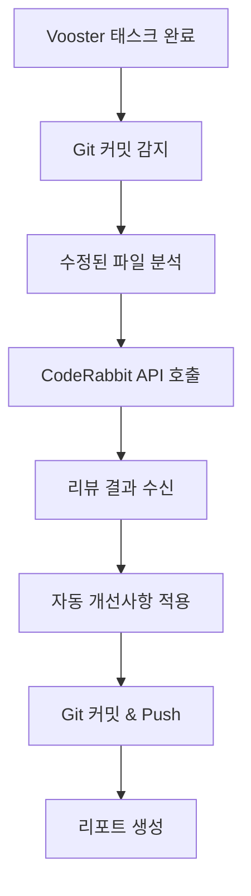
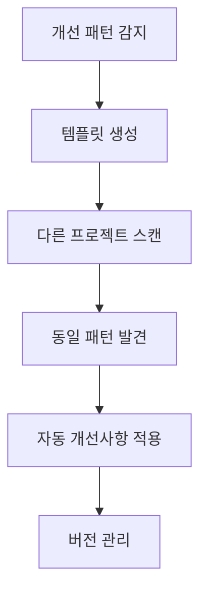

# 🤖 Vooster + CodeRabbit 자동화 시스템 설정 가이드

## 📋 개요

이 시스템은 **모든 개발 작업에 CodeRabbit.ai가 자동으로 적용**되어 코드 검증 및 개선이 이루어지며, **개선사항이 다른 모든 프로젝트에도 자동으로 적용**되는 완전 자동화 시스템입니다.

### ✨ 주요 기능
- 🔍 **Vooster 태스크 완료 시 자동 CodeRabbit 리뷰**
- 🛠️ **자동 개선사항 적용 (Auto-fix)**
- 🔄 **다중 프로젝트 개선사항 동기화**
- 📊 **품질 메트릭 추적 및 리포팅**
- 🚀 **GitHub Actions 완전 자동화**

---

## 🚀 빠른 시작

### 1단계: API 키 설정

GitHub Repository Settings > Secrets and variables > Actions에서 다음 Secrets 추가:

```bash
# 필수 Secrets
CODERABBIT_API_KEY=your_coderabbit_api_key
VOOSTER_API_KEY=your_vooster_api_key

# 선택사항 (이미 있음)
GITHUB_TOKEN=자동_설정됨
VERCEL_TOKEN=your_vercel_token
SUPABASE_ACCESS_TOKEN=your_supabase_token
```

### 2단계: 즉시 실행 테스트

```bash
# 현재 상태 확인
pnpm coderabbit:status

# 완료된 태스크 조회
pnpm coderabbit:tasks

# 전체 자동화 실행
pnpm auto:review
```

### 3단계: GitHub Actions 자동화 활성화

- `.github/workflows/vooster-coderabbit-automation.yml` 이미 설정됨
- 매일 오전 9시 자동 실행
- PR 생성 시 자동 실행
- 수동 실행도 가능

---

## 📁 파일 구조

```
cursor-fullstack-infra/
├── .coderabbit.yaml                    # CodeRabbit 설정 파일
├── .cursor/rules/
│   └── coderabbit-integration.mdc      # Vooster Rules
├── packages/core-scripts/
│   └── vooster-coderabbit-automation.ts # 메인 자동화 스크립트
├── .github/workflows/
│   ├── ci.yml                          # 기존 CI (CodeRabbit 포함)
│   ├── deploy.yml                      # 배포 워크플로우
│   └── vooster-coderabbit-automation.yml # 전체 자동화 워크플로우
├── .coderabbit-templates/              # 개선사항 템플릿 저장소
│   ├── security/
│   ├── performance/
│   ├── architecture/
│   └── style/
└── package.json                        # 자동화 스크립트 추가
```

---

## 🎯 사용법

### 일반 개발 워크플로우

```bash
# 1. 개발 작업 완료
git add .
git commit -m "feat(T-004): 새로운 기능 구현"

# 2. 자동 실행됨 (Background)
# - CodeRabbit 분석
# - 개선사항 자동 적용
# - Git 커밋
# - 리포트 생성

# 3. Pull Request 생성
gh pr create --title "feat: 새로운 기능 추가"

# 4. 최종 CodeRabbit 리뷰 자동 실행
# 5. 개선사항 자동 적용 및 커밋
```

### 수동 실행 명령어

```bash
# 🔍 상태 확인
pnpm coderabbit:status

# 📋 완료된 태스크 조회
pnpm coderabbit:tasks

# 🤖 전체 자동화 실행
pnpm coderabbit:run

# 🔄 다중 프로젝트 동기화
pnpm coderabbit:sync

# 🚀 원클릭 자동 개선 + Push
pnpm auto:improve
```

### GitHub Actions 수동 실행

1. GitHub > Actions > "🤖 Vooster + CodeRabbit 자동화" 선택
2. "Run workflow" 클릭
3. 옵션 선택:
   - **Task Filter**: 특정 태스크만 처리 (예: T-001,T-002)
   - **Dry Run**: 실제 적용 없이 미리보기
   - **Sync Projects**: 다중 프로젝트 동기화 여부

---

## ⚙️ 설정 파일

### .coderabbit.yaml (메인 설정)

```yaml
language: "ko-KR"
reviews:
  profile: "chill"
  auto_review:
    enabled: true
    base_branches: ["main", "master", "develop"]
  path_instructions:
    - path: "apps/webapp/**/*"
      instructions: |
        Next.js 14+ App Router 기반 코드 검토
    - path: "packages/ui/**/*"
      instructions: |
        재사용 가능한 UI 컴포넌트 검토
```

### package.json 스크립트 추가

```json
{
  "scripts": {
    "coderabbit:run": "tsx packages/core-scripts/vooster-coderabbit-automation.ts run",
    "coderabbit:status": "tsx packages/core-scripts/vooster-coderabbit-automation.ts status",
    "auto:review": "pnpm coderabbit:run",
    "auto:improve": "pnpm coderabbit:run && git push"
  }
}
```

---

## 🔄 자동화 시나리오

### 1. 태스크 완료 시 자동 실행



### 2. 다중 프로젝트 동기화



### 3. 품질 게이트

```yaml
quality_gates:
  pass_conditions:
    - security_score: ≥ 90
    - performance_score: ≥ 85
    - maintainability_score: ≥ 80
    - test_coverage: ≥ 80%

  block_conditions:
    - critical_security_vulnerabilities: > 0
    - performance_degradation: > 20%
    - code_complexity: > 10
    - type_safety_violations: > 0
```

---

## 📊 생성되는 리포트

### 자동 생성 파일들

```bash
# 태스크별 리포트
coderabbit-review-T-001.md
coderabbit-review-T-002.md
manual-review-T-001.md

# 전체 요약
vooster-coderabbit-summary.md

# 다중 프로젝트 동기화
cross-project-sync-report.md

# 품질 메트릭
quality-metrics.md
```

### 리포트 내용 예시

```markdown
# CodeRabbit 리뷰 리포트 - T-001

## 📊 요약
- 총 이슈: 15개
- 크리티컬 이슈: 2개
- 자동 수정: 12개
- 실제 적용: 12개

## 🏆 품질 점수
- 보안: 92/100
- 성능: 87/100
- 유지보수성: 85/100

## ✅ 자동 적용된 개선사항
- src/app/page.tsx:23 - console.log 제거
- src/components/Button.tsx:15 - 타입 안전성 개선
- packages/ui/card.tsx:8 - 접근성 속성 추가
```

---

## 🚀 GitHub Actions 워크플로우

### 자동 실행 조건

1. **정기 실행**: 매일 오전 9시
2. **Push 이벤트**: main 브랜치에 `.vooster/` 또는 `packages/core-scripts/` 변경 시
3. **Pull Request**: 생성 또는 업데이트 시
4. **수동 실행**: GitHub Actions 페이지에서

### 워크플로우 단계

```yaml
1. 🔍 사전 검증 (API 키 확인)
2. 🤖 CodeRabbit 자동화 실행
   - 태스크 분석
   - 코드 리뷰 요청
   - 개선사항 적용
   - Git 커밋
3. 📊 품질 메트릭 수집
4. 📢 알림 및 리포트
```

---

## 🔧 고급 설정

### 프로젝트별 특화 설정

```yaml
# .coderabbit.yaml
path_instructions:
  - path: "apps/webapp/**/*"
    instructions: |
      Next.js 프로젝트 특화 검토:
      - Server/Client Components 구분
      - 성능 최적화 (Bundle size, Core Web Vitals)
      - SEO 최적화 검증

  - path: "packages/ui/**/*"
    instructions: |
      UI 컴포넌트 라이브러리 검토:
      - 접근성 (WCAG 2.1 AA) 준수
      - 컴포넌트 API 설계 품질
      - Storybook 문서화
```

### 커스텀 품질 기준

```yaml
quality_gates:
  max_complexity: 10
  max_function_length: 50
  max_file_length: 500
  max_nesting_depth: 4
```

---

## 🐛 문제 해결

### 일반적인 문제

**Q: CodeRabbit API 키가 작동하지 않아요**
```bash
# A: API 키 확인
pnpm coderabbit:status

# GitHub Secrets 설정 확인
# Repository Settings > Secrets and variables > Actions
```

**Q: 자동화가 실행되지 않아요**
```bash
# A: 사전 조건 확인
1. VOOSTER_API_KEY 또는 CODERABBIT_API_KEY 설정
2. .vooster/ 디렉토리에 완료된 태스크 존재
3. GitHub Actions 권한 확인
```

**Q: 개선사항이 적용되지 않아요**
```bash
# A: 로그 확인
1. GitHub Actions > 워크플로우 실행 로그 확인
2. 로컬에서 직접 실행: pnpm coderabbit:run
3. 드라이 런으로 테스트: GitHub Actions에서 Dry Run 체크
```

### 디버깅 명령어

```bash
# 상태 확인
pnpm coderabbit:status

# 로컬 태스크 확인
ls -la .vooster/

# Git 히스토리 확인
git log --oneline --grep="T-" --since="1 week ago"

# 수정된 파일 확인
git diff --name-only HEAD~5 HEAD
```

---

## 📈 성능 및 비용 최적화

### Rate Limiting 대응

```typescript
// 자동화 스크립트에 내장된 지연 처리
await new Promise(resolve => setTimeout(resolve, 3000)); // 태스크 간 3초 대기
```

### 리소스 사용량

- **GitHub Actions 시간**: 태스크당 평균 2-5분
- **API 호출 제한**: CodeRabbit 무료 플랜 고려
- **저장 공간**: 리포트 파일 30일 보관

---

## 🔮 향후 계획

### Phase 1 (완료)
- ✅ 기본 CodeRabbit 통합
- ✅ Vooster 태스크 연계
- ✅ 자동 개선사항 적용
- ✅ GitHub Actions 워크플로우

### Phase 2 (진행 중)
- 🔄 다중 프로젝트 동기화
- 📊 품질 메트릭 대시보드
- 🧠 AI 학습 피드백 시스템

### Phase 3 (계획)
- 🌐 웹 대시보드 구축
- 📱 모바일 알림
- 🤖 더 고도화된 AI 제안
- 📈 예측적 코드 품질 분석

---

## 🤝 기여 및 피드백

이 자동화 시스템은 지속적으로 개선됩니다:

1. **버그 리포트**: GitHub Issues 생성
2. **기능 제안**: GitHub Discussions 활용
3. **코드 기여**: Pull Request 환영
4. **사용 경험 공유**: README에 성공 사례 추가

---

## 📚 참고 자료

- [CodeRabbit 공식 문서](https://docs.coderabbit.ai/)
- [Vooster API 문서](https://api.vooster.ai/docs)
- [GitHub Actions 가이드](https://docs.github.com/en/actions)
- [TypeScript 모범 사례](https://typescript-eslint.io/)

---

